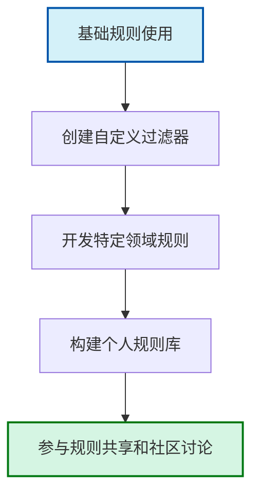
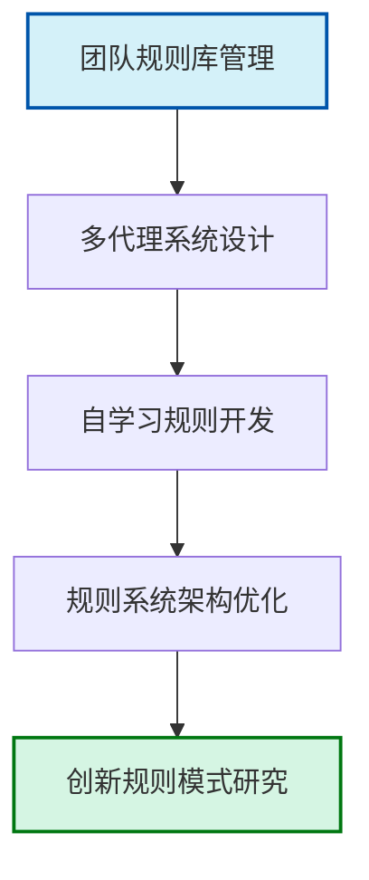
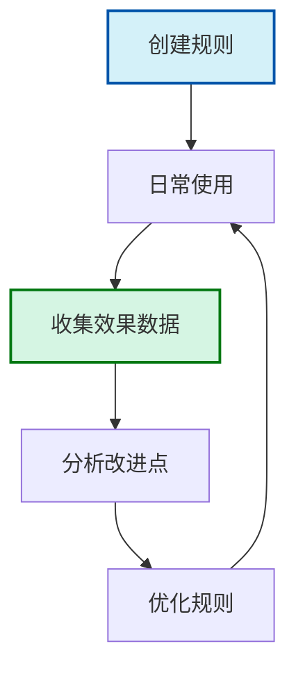

# 未来发展方向

在完成了前面九章的学习后，您已经掌握了Cursor Rules的核心概念、基础应用和高级技术。本章将引导您展望Cursor Rules的未来发展方向，帮助您持续跟进这一领域的最新进展，并规划自己的学习路径。

## 学习目标

- 了解Cursor Rules的未来发展趋势和新特性
- 探索支持Cursor Rules持续学习的社区资源
- 规划个人在Cursor Rules领域的成长路径
- 预测AI辅助编程工具的长期发展方向

## Cursor Rules的新特性与趋势

Cursor作为一个活跃发展的AI辅助编程工具，其规则系统也在不断演进。以下是一些值得关注的新特性和趋势：

### 1. 多模态规则支持

未来的Cursor Rules很可能扩展到更多模态：

```rule
<rule>
name: multimodal_rule_example
description: 一个支持多模态的规则示例

filters:
  - type: code_context
    pattern: "function.*\\(.*\\)"
  - type: visual_context
    pattern: "diagram|flowchart|mockup"
  - type: voice_command
    pattern: "refactor|optimize|document"

actions:
  - type: suggest
    suggestion: "检测到您正在处理这段代码的同时查看相关图表，是否需要根据图表更新代码实现？"
  - type: visual_highlight
    regions: [
      { type: "code", lines: "10-15" },
      { type: "diagram", area: "component_3" }
    ]

metadata:
  priority: medium
  version: 1.0.0
  tags: ["multimodal", "future"]
</rule>
```

这种多模态规则将能够响应代码、图表、语音命令和其他上下文的组合，提供更全面的辅助体验。

### 2. 基于大型语言模型的规则生成

随着大型语言模型能力的提升，未来将出现更智能的规则生成方式：

```bash
# Windows PowerShell中使用自然语言生成规则的示例
$naturalLanguageDescription = "创建一个规则，检测循环中可能的数组越界问题，并建议添加边界检查"

# 调用规则生成API
$generatedRule = Invoke-RestMethod -Uri "https://api.cursor.sh/rule-generation" -Method POST -Body @{
    description = $naturalLanguageDescription
    targetLanguage = "javascript"
    complexity = "medium"
} -ContentType "application/json"

# 保存生成的规则
$generatedRule | Out-File -FilePath ".\array_boundary_check.mdc"

Write-Output "已生成规则并保存到 array_boundary_check.mdc"
```

这种方式将极大降低创建规则的门槛，使非技术用户也能定制个性化的编程助手。

### 3. 协作规则与团队智能

未来的规则系统将更注重团队协作维度：

```rule
<rule>
name: team_knowledge_sharing
description: 基于团队知识库自动共享相关经验

filters:
  - type: code_context
    pattern: "db\\.query\\(|apiClient\\.request\\("
  - type: project_context
    pattern: "team/shared-services"

actions:
  - type: knowledge_lookup
    handler: |
      async function lookupTeamKnowledge(context, codeFragment) {
        // 连接到团队知识库
        const teamKnowledge = await context.services.getTeamKnowledge();
        
        // 分析代码片段，提取关键概念
        const concepts = extractConcepts(codeFragment);
        
        // 在知识库中查找相关经验
        const relevantExperiences = await teamKnowledge.query({
          concepts,
          authors: context.teamMembers,
          lastUpdated: { $gt: Date.now() - 90 * 24 * 60 * 60 * 1000 } // 过去90天
        });
        
        if (relevantExperiences.length > 0) {
          return {
            type: 'suggestion',
            content: `团队成员${relevantExperiences[0].author}在处理类似代码时有相关经验: ${relevantExperiences[0].summary}`,
            relatedExperiences: relevantExperiences
          };
        }
        
        return null;
      }

metadata:
  priority: medium
  version: 1.0.0
  tags: ["collaboration", "team-intelligence"]
</rule>
```

这种协作规则能够融合团队的集体智慧，实现经验的自动共享和知识的传承。

### 4. 规则市场生态

随着Cursor Rules的普及，可能会出现专门的规则市场：

```json
// 规则市场示例API响应
{
  "marketplaceStats": {
    "totalRules": 12749,
    "totalDownloads": 8431926,
    "activeContributors": 1283,
    "lastUpdated": "2025-03-14T18:35:42Z"
  },
  "popularCategories": [
    { "name": "JavaScript开发", "ruleCount": 2314, "downloadCount": 1245789 },
    { "name": "Python数据科学", "ruleCount": 1876, "downloadCount": 987234 },
    { "name": "DevOps自动化", "ruleCount": 1531, "downloadCount": 876543 },
    { "name": "代码安全", "ruleCount": 945, "downloadCount": 654321 },
    { "name": "文档生成", "ruleCount": 823, "downloadCount": 543210 }
  ],
  "trendingRules": [
    {
      "id": "react-performance-analyzer",
      "name": "React性能分析器",
      "author": "react-masters",
      "rating": 4.9,
      "downloadCount": 12543,
      "price": "免费",
      "description": "自动检测React应用中的性能问题并提供优化建议"
    },
    // 更多规则...
  ]
}
```

这样的市场将促进规则开发的专业化和商业化，形成丰富的生态系统。

### 5. 跨工具规则标准

随着AI编程助手的普及，可能会出现跨工具的规则标准：

```xml
<!-- 通用规则交换格式示例 (UREF - Universal Rule Exchange Format) -->
<uref version="1.0">
  <rule-metadata>
    <name>universal_code_reviewer</name>
    <version>2.1.0</version>
    <author>ai-code-standards</author>
    <compatibility>
      <tool name="cursor" min-version="3.0" />
      <tool name="copilot" min-version="2.5" />
      <tool name="codewhisperer" min-version="1.8" />
    </compatibility>
  </rule-metadata>
  
  <rule-definition>
    <filters>
      <!-- 通用过滤器语法 -->
    </filters>
    <actions>
      <!-- 通用动作语法 -->
    </actions>
  </rule-definition>
  
  <tool-specific-extensions>
    <!-- 各工具特定扩展 -->
  </tool-specific-extensions>
</uref>
```

这种标准将使开发者能够一次编写规则，在多个AI编程助手中使用，提高规则投资的回报率。

## 社区资源与学习路径

### 1. 官方资源

Cursor的官方资源是跟踪最新发展的重要渠道：

- **官方文档**: 定期查阅[Cursor官方文档](https://cursor.sh/docs)获取最新功能和API更新
- **发布说明**: 关注每次发布的更新日志，了解新特性和改进
- **官方博客**: 阅读深度技术文章和案例研究
- **视频教程**: 观看官方视频教程，学习最佳实践

### 2. 社区资源

活跃参与社区是持续学习的重要方式：

- **GitHub仓库**: 关注[Cursor相关的开源项目](https://github.com/topics/cursor-ide)
- **Stack Overflow**: 参与问答，解决实际问题
- **Reddit社区**: 加入r/CursorIDE和相关子版块
- **Discord频道**: 参与实时讨论和经验交流

### 3. 学习路径建议

根据您的目标和经验，可以选择不同的学习路径：

#### 初级到中级路径



1. **掌握基础** (1-2个月)
   - 完成本教程前5章的学习
   - 创建10-15个简单规则解决日常问题
   - 参加入门级在线研讨会

2. **构建规则库** (2-3个月)
   - 为自己常用的编程语言创建专用规则集
   - 实现工作流自动化规则
   - 尝试不同类型的过滤器和动作

3. **社区参与** (持续)
   - 分享您的规则到社区
   - 参与规则改进讨论
   - 为开源规则库做贡献

#### 中级到高级路径



1. **团队规则管理** (2-3个月)
   - 设计团队规则库架构
   - 实现规则版本控制和协作流程
   - 创建团队特定的规则模板

2. **高级系统设计** (3-6个月)
   - 设计多代理协作系统
   - 开发自学习规则原型
   - 集成外部系统和API

3. **创新与研究** (持续)
   - 探索新型规则模式
   - 参与规则标准的讨论
   - 发表技术文章和研究成果

## 个人成长计划模板

以下是一个个人在Cursor Rules领域成长的计划模板：

### 个人目标设定

```yaml
# 个人Cursor Rules成长计划
name: "您的名字"
current_level: "初级/中级/高级"
target_level: "中级/高级/专家"
timeframe: "6个月/1年/2年"

short_term_goals:
  - "在2周内创建5个提高日常编码效率的规则"
  - "在1个月内将规则应用到当前项目中，提高20%的生产力"
  - "在2个月内构建个人规则库，包含至少30个自定义规则"

medium_term_goals:
  - "在3-6个月内，为团队开发特定领域的规则集"
  - "在6个月内，实现至少一个自学习规则原型"
  - "参与至少2个社区项目或讨论"

long_term_goals:
  - "成为组织内的Cursor Rules专家"
  - "为开源规则库做出重要贡献"
  - "探索规则系统与其他AI技术的结合"

learning_resources:
  - "完成CorLings教程系列"
  - "参加Cursor官方网络研讨会"
  - "阅读5本相关技术书籍"
  - "参与3个相关线上社区"

progress_tracking:
  - review_frequency: "每周/每月/每季度"
  - metrics:
      - "创建的规则数量"
      - "规则的使用频率"
      - "通过规则节省的时间"
      - "团队规则采纳率"
```

## Cursor与AI编程工具的长期展望

放眼未来，Cursor和类似的AI编程工具可能经历以下演进：

### 1. 从辅助工具到编程伙伴

未来的Cursor可能从单纯的辅助工具发展为真正的编程伙伴：

```
┌─────────────────────────────────────────────────────────┐
│                                                         │
│  演进路径：工具 → 助手 → 伙伴 → 协作者                  │
│                                                         │
│  • 工具阶段：执行特定任务                               │
│  • 助手阶段：提供建议和帮助                             │
│  • 伙伴阶段：理解上下文和意图                           │
│  • 协作者阶段：主动参与决策和问题解决                   │
│                                                         │
└─────────────────────────────────────────────────────────┘
```

### 2. 编程范式的转变

AI可能带来编程范式的根本性转变：

```
传统编程: 人类 → 编写代码 → 计算机执行

当前阶段: 人类 → 编写代码 + AI辅助 → 计算机执行

未来阶段: 人类 → 描述意图 + AI解释/实现 → 计算机执行
```

这种转变可能使编程变得更加抽象和意图导向，而Cursor Rules将在这一过程中扮演桥梁作用。

### 3. 知识工作的重新定义

长期来看，Cursor等工具可能重新定义软件开发中的知识工作：

```
┌───────────────────┐    ┌───────────────────┐    ┌───────────────────┐
│                   │    │                   │    │                   │
│  开发者角色变化   │ → │  创造力与判断力   │ → │  专业化与融合     │
│                   │    │                   │    │                   │
└───────────────────┘    └───────────────────┘    └───────────────────┘

● 从编码实现者转变为系统设计师和决策者
● 创造力和判断力成为核心竞争力
● 跨领域知识融合成为新趋势
```

## 实践建议与行动计划

### 1. 持续学习策略

```rule
<rule>
name: continuous_learning_reminder
description: 提醒进行持续学习和技能更新

filters:
  - type: schedule
    pattern: "weekly:monday:9am"

actions:
  - type: notify
    message: |
      📚 本周学习提醒
      
      - 查看Cursor的最新更新和功能
      - 花30分钟改进一个现有规则
      - 阅读一篇关于AI编程工具的文章
      - 在社区分享您的一个规则或经验
      
      记录您的学习进展，以跟踪成长！
  - type: suggest
    suggestion: "设置20分钟来查看最新的Cursor更新和社区动态。"

metadata:
  priority: medium
  version: 1.0.0
  tags: ["learning", "reminder"]
</rule>
```

### 2. 30天规则挑战

挑战自己在30天内每天创建一个新规则，逐步提高技能：

```
第1-10天：基础规则（文本转换、代码格式化等）
第11-20天：工作流规则（测试生成、文档更新等）
第21-30天：高级规则（自定义分析器、多步骤助手等）
```

### 3. 建立反馈循环



持续记录规则的使用效果，并定期优化：

```javascript
// 规则使用数据跟踪示例
const ruleFeedbackData = {
  ruleId: "jsx_component_refactor",
  usageCount: 47,
  acceptanceRate: 0.83,
  timesSaved: "约8.5小时",
  commonModifications: ["添加更多属性", "调整组件结构"],
  improvementIdeas: [
    "增加对React Hooks的更好支持",
    "添加TypeScript类型自动推导",
    "提供多种重构选项"
  ]
};
```

## 小结

Cursor Rules的未来充满无限可能。随着AI技术的快速发展，规则系统将变得更加智能、直观和强大。作为开发者，持续学习、尝试新功能、积极参与社区将帮助您在这一领域保持领先地位。

无论是提高个人生产力，还是推动团队效率，Cursor Rules都能提供宝贵的支持。通过本章提供的资源和路径，您可以制定个性化的学习计划，在AI辅助编程的新时代中充分发挥潜力。

记住，技术工具在不断演进，但核心价值始终在于解决实际问题和创造价值。将Cursor Rules视为强大的助手，而不仅仅是一个工具，将帮助您最大化其潜力。

祝您在Cursor Rules的探索之旅中取得丰硕成果！

---

## 实践练习

1. **未来预测**: 写下您认为Cursor Rules在3年内可能出现的3个新功能
2. **学习计划**: 根据本章提供的模板，创建您自己的Cursor Rules学习计划
3. **创新规则**: 尝试设计一个融合本章讨论的未来趋势的创新规则
4. **社区参与**: 加入至少一个Cursor相关社区，并参与一次讨论
5. **反思与分享**: 回顾您的Cursor Rules学习旅程，写下最大的收获和挑战 